# MP Burger 🍔

### Link do projeto rodando na Vercel:

🔗 | [Clique aqui para ver o projeto em execução](https://mp-burguer-place.vercel.app/)

## 🚨 Sobre

- **MP Burger** é uma hamburgueria desenvolvida em React e um servidor JSON-Server para armazenar pedidos quando houver um no carrinho. Não foi criado nenhum servidor altamente profissional, a intenção era apenas armazenar as requisições em algum lugar, sem que eu me preocupasse em criar um schema e armazená-las dentro de um banco de dados.

- A lanchonete fictícia **abre às 18h horário de Brasília** e **fecha às 23h**, fora desse período **não** é possível fazer nenhum pedido, pois o estabelecimento está fechado. Neste projeto foram gerados um CNPJ e um endereço, ambos aleatórios, para a hamburgueria.

- Não tenho ideia do preço dos alimentos, todos os valores foram gerados com preço e quantidade que vieram da minha cabeça, as imagens dos lanches, pratos, bebidas e sobremesas foram geradas com inteligência artificial (IA).

<div align="center">

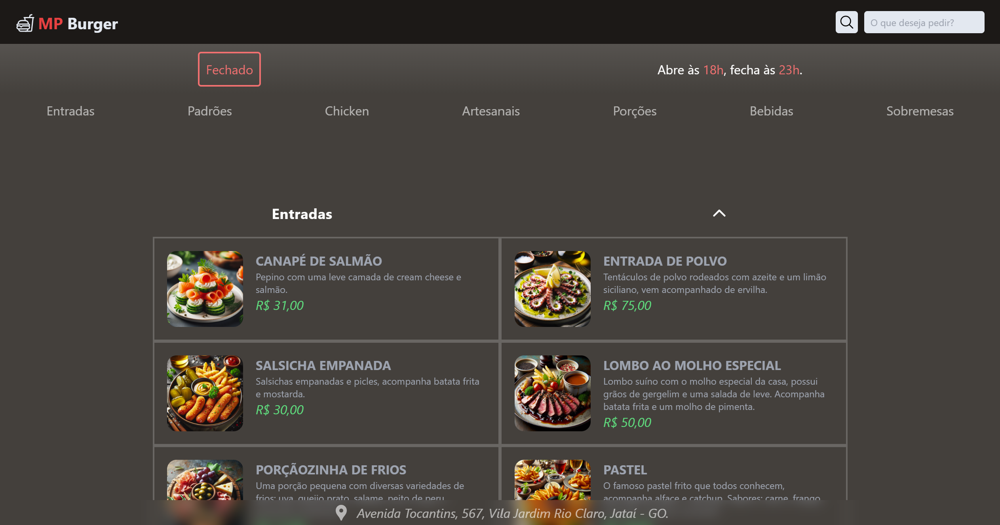

</div>

---

### Categorias
Temos diversas categorias de alimentos, incluindo: 
"**Entradas**", "**Padrões**", "**Chicken**", "**Artesanais**", "**Porções**", "**Bebidas**" e "**Sobremesas**".

**01. Entradas**

- Pequenas porções, como se fosse mesmo uma entrada de restaurante. Pense neles como uma “opção” para incluir na refeição.

**02. Padrões**

- Lanche padrão que todo mundo conhece, o famoso X Bacon, X Salada, X Presunto, entre outros...

**03. Chicken**

- Igual ao lanche padrão, porém, em vez de carne bovina é frango, esses lanches se chamam Galis alguma coisa, seja Galis Bacon, Galis Tudo, tanto faz.

**04. Artesanais**

- Nessas opções são demonstrados os hambúrgueres artesanais (ou gourmet), que consequentemente têm o preço mais elevado devido ao seu método especial de preparo e à alta seleção de seus ingredientes.

**05. Porções**

- Ao contrário das entradas, esta seção apresenta alguns pratos que podem ser servidos como refeição, já que a maioria costuma ser acompanhada de arroz, feijão e salada, entre outras opções.

**06. Bebidas**

- Autoexplicativo, aqui mostra as bebidas disponíveis para consumo na hamburgueria. Foi colocado um aviso na seleção de uma bebida alcoólica, alertando o usuário que o estabelecimento não vende esse tipo de bebida para menores de 18 anos.

**07. Sobremesas**

- Algumas opções de sobremesas. Foram adicionados apenas um pudim e um mousse de maracujá, pois a IA não conseguiu fazer um petit-gateau de jeito nenhum.

>**Observação:** ao clicar na categoria do menu de navegação que fica fixo na tela, você será levado para onde aquela categoria começa.

---

### Procurando por itens
- No cabeçalho da aplicação, temos um campo de busca onde você pode pesquisar pelo nome dos itens. O filtro é **case insensitive**, ou seja, não considera letras minúsculas e maiúsculas, se você pesquisar por "salada" ou "Salada" ou mesmo "SALADA", não irá interferir, o filtro irá procurar por todos os itens que possuem “salada” no nome e irão mostrar na tela para o usuário, cabe a ele escolher qual opção mais lhe agrada.

<div align="center">

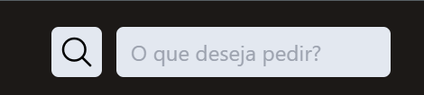

</div>

---

### Como fazer um pedido
- Fazer um pedido é simples, basta clicar no que deseja pedir e aparecerá um modal com algumas opções. Cada item possui seu modal individual, com opções exclusivas apenas para aquele item. Todos os itens permitem que o usuário escreva uma observação se desejar, por exemplo: não há necessidade de fritar muito a cebola.

- Alguns itens possuem valores adicionais que são deduzidos do valor final do seu pedido. Os valores que diminuem o valor final estão em vermelho, os que aumentam estão em verde e os que não alteram o valor estão escritos exatamente isso em cinza. O valor total do pedido é atualizado em tempo real e esse é o valor que vai para o seu carrinho ao finalizá-lo.

- Cada campo preenchido fica armazenado no local storage, ou seja, mesmo que o usuário recarregue ou feche a página, o pedido que ele fez ao clicar em “**Adicionar ao carrinho**” (que só está disponível se o estabelecimento estiver aberto) permanece. Ao fazer isso, a página é recarregada e a opção “**Carrinho**” aparece para o usuário no canto inferior direito da tela, permitindo que o usuário continue fazendo mais pedidos ou não.

<div align="center">

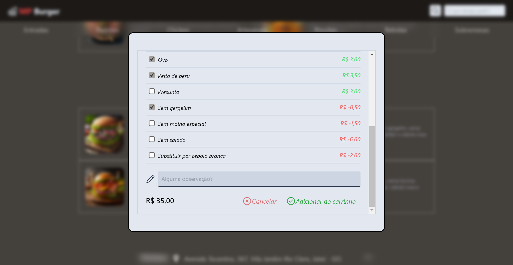

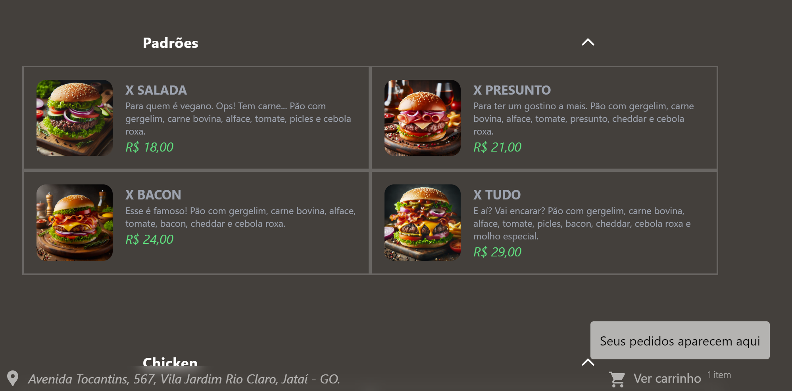

</div>

---

### Finalizando o pedido
No "**Carrinho**", você terá dois campos: "**Revise seu pedido**" e "**Complete seu pedido**".

<div align="center">

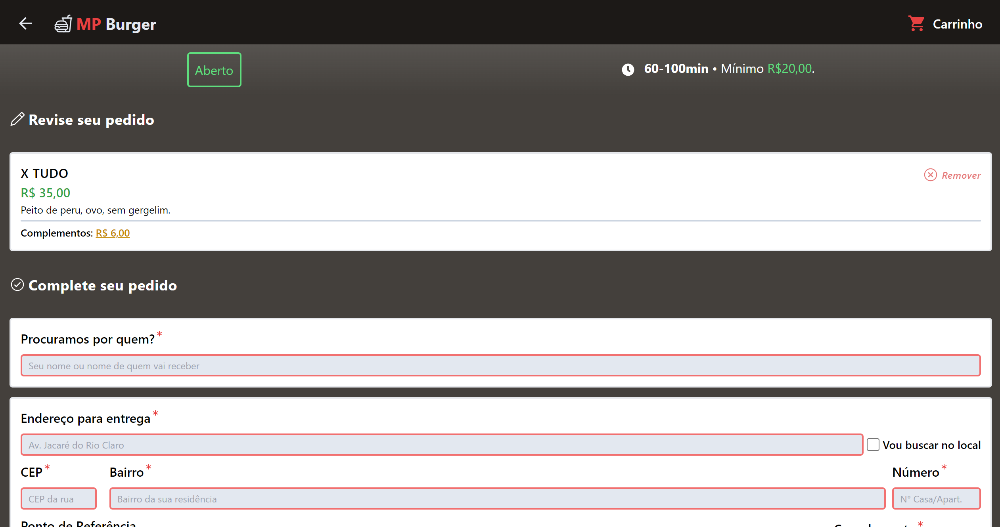

</div>

#### Revise seu pedido
- Aqui aparecerão todos os itens que você adicionou, com tudo o que você encomendou, seus opcionais, o preço desses opcionais e seus comentários. O preço dos extras está em amarelo em “**Complementos**”, pode ser um valor positivo, negativo ou até mesmo não haver valor. O valor final a ser pago aparece em verde, logo abaixo do nome do pedido. É nesta aba que o usuário irá revisar seu pedido e retirar itens do carrinho se desejar.

<div align="center">

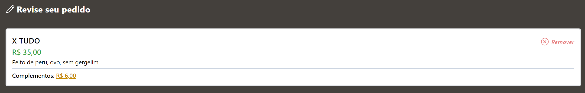

</div>

#### Complete seu pedido

<div align="center">

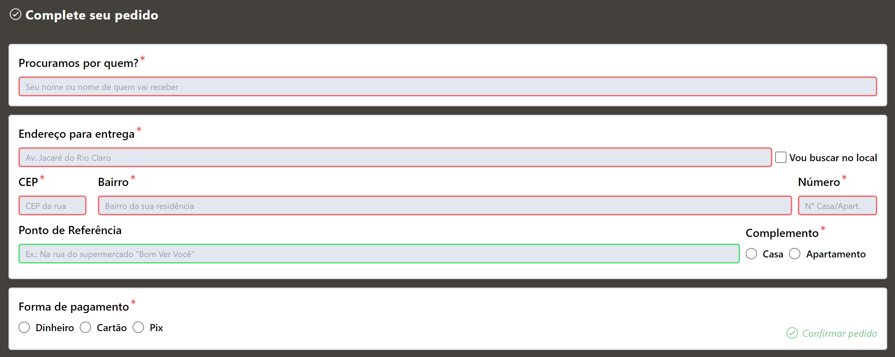

</div>

- Nesta aba existe um formulário para preencher com algumas informações, como: "**Nome**", "**Endereço**", "**CEP**", "**Bairro**", " **Ponto de referência**", "**Complemento**" e "**Forma de pagamento**". Ao lado do campo para preenchimento do endereço de entrega, há uma checkbox “**Vou retirar no local**”, ao marcá-la, todas as informações referentes à entrega serão desativadas, fazendo com que o usuário preencha apenas o nome e a forma de pagamento. Os campos obrigatórios estão marcados em vermelho e também possuem um asterisco vermelho, o campo CEP por exemplo, o usuário é obrigado a escrever o CEP no formato correto, quando esse evento acontecer o campo ficará verde, isso vale também para os demais campos do formulário. Depois que tudo acontecer, o carrinho é zerado e outro pedido pode ser feito novamente.

<div align="center">

<small>
Sem a checbox marcada
</small>

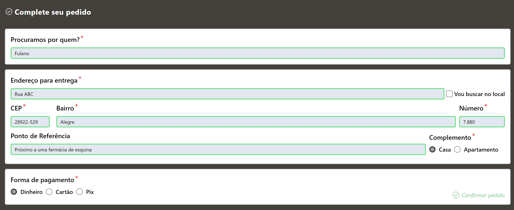

<small>
Com a checbox marcada
</small>

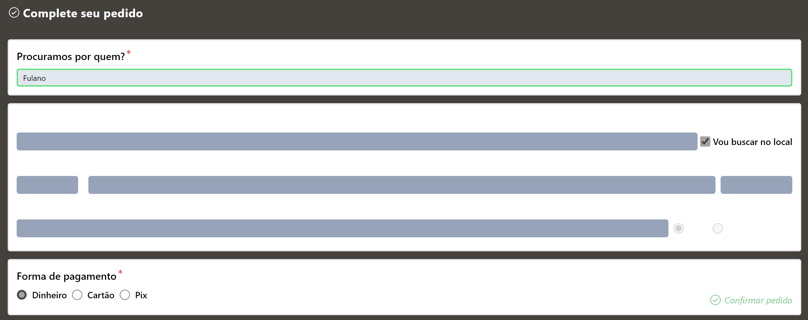

</div>

- Caso o usuário clique no botão “**Confirmar pedido**” localizado no final do formulário, antes de preencher os campos obrigatórios, aparecerá uma mensagem alertando o usuário que ainda existem campos a serem preenchidos, o usuário não poderá completar o pedido se ele não completar o que é obrigatório. Se ele tiver preenchido tudo e clicar no botão, o texto do botão mudará e ele será desativado, aparecerá uma mensagem informando que o pedido foi realizado com sucesso.

<div align="center">

<small>
Mensagem de que está faltando algo
</small>

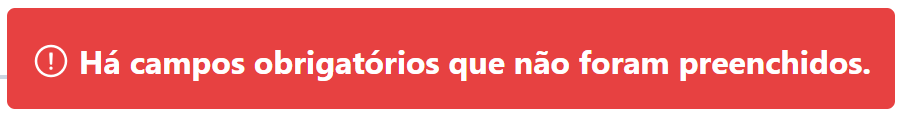

<small>
Mensagem de sucesso
</small>

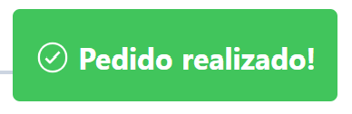


</div>

- Quando a checkbox é marcada, apenas o nome, forma de pagamento e pedido são enviados ao servidor. Se não estiver marcada, todos os itens do formulário serão enviados.

- Aqui está um exemplo de como os dados chegam no servidor quando a checbox está desmarcada de acordo com o exemplo:
```JSON
{
  "orders": [
    {
      "id": "90a3",
      "name": "Fulano",
      "address": "Rua ABC",
      "zipCode": "28922-529",
      "neighborhood": "Alegre",
      "number": "7.880",
      "referencePoint": "Próximo a uma farmácia de esquina",
      "complement": "house",
      "formOfPayment": "money",
      "order": [
        {
          "description": "X Tudo",
          "price": 35,
          "extras": [
            "Peito de peru",
            "Ovo",
            "Sem gergelim"
          ]
        }
      ],
      "submittedAt": "02/06/2024, 12:30:17"
    }
  ]
}
```

## ⛏️ Ferramentas utilizadas

- [React](https://react.dev/)
- [React Icons](https://react-icons.github.io/react-icons/)
- [React Router DOM](https://www.npmjs.com/package/react-router-dom)
- [Node](https://nodejs.org/en)
- [JSON-Server](https://www.npmjs.com/package/json-server)
- [Tailwind CSS](https://tailwindcss.com/)

## 💻 Como executar o projeto na minha máquina?

- Clone ou baixe o ZIP do repositório.
- Crie um arquivo chamado *__orders.json__* na raíz do projeto:

```Shell
PS C:\burger echo. > orders.json
```

- Dentro desse arquivo, escreva:

```JSON
{
	"orders": []
}
```

- Na sequência, inicialize o servidor JSON com:
```Shell
PS C:\burger json-server --watch orders.json --port 3001
```
> **Observações:** caso o arquivo json não seja criado ou o servidor não seja inicializado, um erro irá aparecer na hora de confirmar o pedido.

- Inicie o projeto com:
```Shell
# Você precisará do Node.js instalado em sua máquina para conseguir executar esse comando.

PS C:\burger npm run dev
```

- Após esse processo, você já estará conseguindo utilizar normalmente o projeto.

> **Observação:** a hamburgueria só funciona a partir das 18h e vai até às 23h, caso você queira que ela fique aberta direto para fazer os pedidos, basta mudar o valor da constante **isOpen** que pode ser encontrada em "_src/exported/constants_". Não apague ou comente essa constante.
```JavaScript
// Altere de:
export const isOpen = hours >= openingTime && hours < closingTime

// Para:
export const isOpen = hours
```
